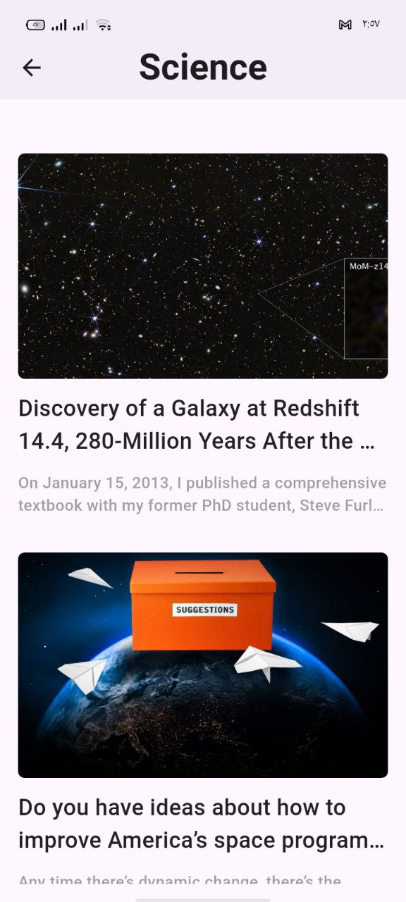

# 📰 News App 📱

A complete **News Application** built with **Flutter**, starting from UI design to real API integration.  
This project is part of **Eng. Tharwat Samy Flutter Course** and is still under active development 🚀.

مشروع تطبيق أخبار متكامل باستخدام Flutter، تم تنفيذ الواجهة وربطها بـ API حقيقي مع تنظيم الكود واستخدام Widgets متقدمة.

### تحميل التطبيق 📥
يمكنك تحميل أحدث نسخة تجريبية من التطبيق (APK) من الرابط التالي:
[اضغط هنا لتحميل App Release](https://github.com/Abdulrahman715/News_App/releases/download/v1.0.0/release-apk.zip)

> **ملاحظة:** الملف مضغوط بصيغة ZIP، بعد التحميل فك الضغط عنه وهتلاقي ملف الـ APK جواه.
---

## ✅ Current Progress (ما تم إنجازه)

### 🎨 UI & Design
- [x] تصميم الواجهة الرئيسية (Home Screen UI)
- [x] تصميم كروت عرض الأخبار (News Tile UI)
- [x] استخدام **CustomScrollView** مع Slivers
- [x] إضافة قائمة الأقسام بشكل عرضي (Horizontal Categories)

**Available Categories:**
- Business  
- Sports  
- Technology  
- General  
- Science  
- Health  
- Entertainment  

---

### 🌐 API & Data Handling
- [x] ربط التطبيق بـ **News API**
- [x] جلب الأخبار ديناميكيًا حسب القسم
- [x] استخدام **FutureBuilder** للتعامل مع الحالات الثلاث:
  - Loading State
  - Error State
  - Data Received State
- [x] معالجة الأخطاء بشكل آمن

---

### 🔄 Performance & UX
- [x] Pagination (تحميل الأخبار على مراحل)
- [x] Pull To Refresh باستخدام **RefreshIndicator**
- [x] تحسين تجربة المستخدم أثناء تحميل البيانات

---

### 📄 Navigation
- [x] إنشاء صفحة تفاصيل الخبر
- [x] عند الضغط على الخبر يتم عرض:
  - العنوان الكامل
  - الصورة
  - محتوى الخبر
  - تاريخ النشر
  - المصدر

---

## 🛠️ Technologies & Tools
- Flutter
- Dart
- Material Design
- Dio (HTTP Requests)
- News API
- FutureBuilder
- CustomScrollView & Slivers

---

## 📚 What I Learned From This Project
- التعامل مع REST APIs في Flutter
- إدارة الحالات باستخدام FutureBuilder
- بناء UI مرن باستخدام Slivers
- Pagination وتحسين الأداء
- فصل الـ UI عن منطق جلب البيانات
- تنظيم المشروع بشكل احترافي

---

## 🔮 Next Steps (الخطوات القادمة)
- [ ] تطبيق State Management (Cubit / Provider)
- [ ] تحسين UI لصفحة تفاصيل الخبر
- [ ] إضافة Search Feature
- [ ] Dark Mode
- [ ] Cache البيانات (Offline Mode)

---

## 👨‍💻 Author
**Abdulrahman Muhammad**  
Flutter Developer 🚀
